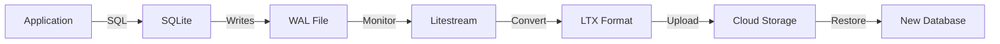
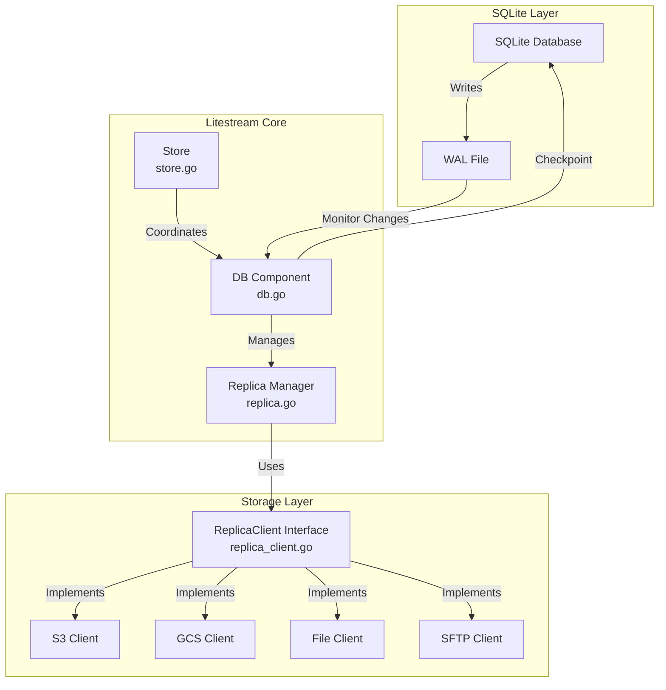
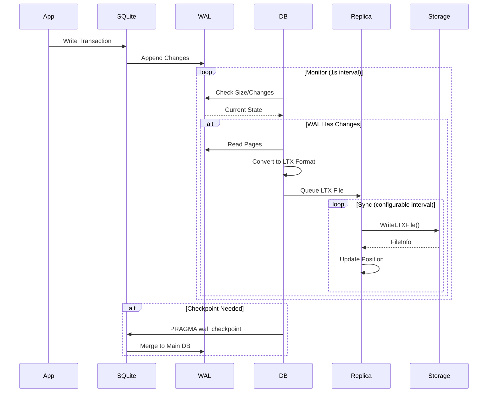
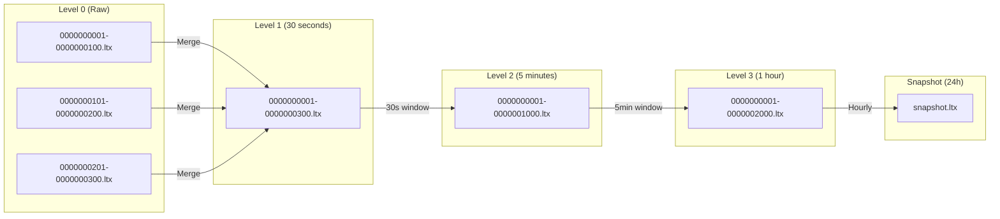

# AGENT.md - Litestream AI Agent Documentation

This document provides comprehensive guidance for AI agents working with the Litestream codebase. Read this document carefully before making any modifications.

## Table of Contents

- [Overview](#overview)
- [Fundamental Concepts](#fundamental-concepts)
- [Core Architecture](#core-architecture)
- [Critical Concepts](#critical-concepts)
- [Architectural Boundaries and Patterns](#architectural-boundaries-and-patterns)
- [Common Pitfalls](#common-pitfalls)
- [Component Guide](#component-guide)
- [Performance Considerations](#performance-considerations)
- [Testing Requirements](#testing-requirements)

## Overview

Litestream is a **disaster recovery tool for SQLite** that runs as a background process and safely replicates changes incrementally to various storage backends. It monitors SQLite's Write-Ahead Log (WAL), converts changes to an immutable LTX format, and replicates these to configured destinations.

**Current Architecture Highlights:**
- **LTX Format**: Page-level replication format replaces direct WAL mirroring
- **Multi-level Compaction**: Hierarchical compaction keeps storage efficient (30s → 5m → 1h → snapshots)
- **Single Replica Constraint**: Each database is replicated to exactly one remote destination
- **Pure Go Build**: Uses `modernc.org/sqlite`, so no CGO dependency for the main binary
- **Optional NATS JetStream Support**: Additional replica backend alongside S3/GCS/ABS/OSS/File/SFTP
- **Snapshot Compatibility**: Only LTX-based backups are supported—keep legacy v0.3.x binaries to restore old WAL snapshots

**Key Design Principles:**
- **Non-invasive**: Uses only SQLite API, never directly manipulates database files
- **Incremental**: Replicates only changes, not full databases
- **Single-destination**: Exactly one replica destination per database
- **Eventually Consistent**: Handles storage backends with eventual consistency
- **Safe**: Maintains long-running read transactions for consistency

## Fundamental Concepts

**CRITICAL**: Understanding SQLite internals and the LTX format is essential for working with Litestream.

### Required Reading

1. **[SQLite Internals](docs/SQLITE_INTERNALS.md)** - Understand WAL, pages, transactions, and the 1GB lock page
2. **[LTX Format](docs/LTX_FORMAT.md)** - Learn the custom replication format Litestream uses

### Key SQLite Concepts

- **WAL (Write-Ahead Log)**: Temporary file containing uncommitted changes
- **Pages**: Fixed-size blocks (typically 4KB) that make up the database
- **Lock Page at 1GB**: Special page at 0x40000000 that MUST be skipped
- **Checkpoints**: Process of merging WAL back into main database
- **Transaction Isolation**: Long-running read transaction for consistency

### Key LTX Concepts

- **Immutable Files**: Once written, LTX files are never modified
- **TXID Ranges**: Each file covers a range of transaction IDs
- **Page Index**: Binary search tree for efficient page lookup
- **Compaction Levels**: Time-based merging to reduce storage (30s → 5min → 1hr)
- **Checksums**: CRC-64 integrity verification at multiple levels
- **CLI Command**: Use `litestream ltx` (not `wal`) for LTX operations

### The Replication Flow



## Core Architecture



### Data Flow Sequence



## Critical Concepts

### 1. SQLite Lock Page at 1GB Boundary ⚠️

**CRITICAL**: SQLite reserves a special lock page at exactly 1GB (0x40000000 bytes).

```go
// db.go:951-953 - Must skip lock page during replication
lockPgno := ltx.LockPgno(pageSize)  // Page number varies by page size
if pgno == lockPgno {
    continue // Skip this page - it's reserved by SQLite
}
```

**Lock Page Numbers by Page Size:**
- 4KB pages: 262145 (most common)
- 8KB pages: 131073
- 16KB pages: 65537
- 32KB pages: 32769

**Testing Requirement**: Any changes affecting page iteration MUST be tested with >1GB databases.

### 2. LTX File Format

LTX (Log Transaction) files are **immutable**, append-only files containing:
- Header with transaction IDs (MinTXID, MaxTXID)
- Page data with checksums
- Page index for efficient seeking
- Trailer with metadata

**Important**: LTX files are NOT SQLite WAL files - they're a custom format for efficient replication.

### 3. Compaction Process

Compaction merges multiple LTX files to reduce storage overhead:



**Critical Compaction Rule**: When compacting with eventually consistent storage:
```go
// db.go:1280-1294 - ALWAYS read from local disk when available
f, err := os.Open(db.LTXPath(info.Level, info.MinTXID, info.MaxTXID))
if err == nil {
    // Use local file - it's complete and consistent
    return f, nil
}
// Only fall back to remote if local doesn't exist
return replica.Client.OpenLTXFile(...)
```

### 4. Eventual Consistency Handling

Many storage backends (S3, R2, etc.) are eventually consistent. This means:
- A file you just wrote might not be immediately readable
- A file might be listed but only partially available
- Reads might return stale or incomplete data

**Solution**: Always prefer local files during compaction.

## Architectural Boundaries and Patterns

**CRITICAL**: Understanding proper architectural boundaries is essential for successful contributions.

### Layer Responsibilities

```mermaid
graph TB
    subgraph "DB Layer (db.go)"
        DBInit[DB.init&#40;&#41;]
        DBPos[DB position tracking]
        DBRestore[Database state validation]
        DBSnapshot[Snapshot triggering via verify&#40;&#41;]
    end

    subgraph "Replica Layer (replica.go)"
        ReplicaStart[Replica.Start&#40;&#41;]
        ReplicaSync[Sync operations]
        ReplicaPos[Replica position tracking]
        ReplicaClient[Storage interaction]
    end

    subgraph "Storage Layer"
        S3[S3/GCS/Azure]
        LTXFiles[LTX Files]
    end

    DBInit -->|Initialize| ReplicaStart
    DBInit -->|Check positions| DBPos
    DBInit -->|Validate state| DBRestore
    ReplicaStart -->|Focus on replication only| ReplicaSync
    ReplicaSync -->|Upload/Download| ReplicaClient
    ReplicaClient -->|Read/Write| S3
    S3 -->|Store| LTXFiles
```



### ✅ DO: Handle database state in DB layer

**Principle**: Database restoration logic belongs in the DB layer, not the Replica layer.

**Pattern**: When the database is behind the replica (local TXID < remote TXID):

1. **Clear local L0 cache**: Remove the entire L0 directory and recreate it
   - Use `os.RemoveAll()` on the L0 directory path
   - Recreate with proper permissions using `internal.MkdirAll()`

2. **Fetch latest L0 file from replica**: Download the most recent L0 LTX file
   - Call `replica.Client.OpenLTXFile()` with the remote min/max TXID
   - Stream the file contents (don't load into memory)

3. **Write using atomic file operations**: Prevent partial/corrupted files
   - Write to temporary file with `.tmp` suffix
   - Call `Sync()` to ensure data is on disk
   - Atomically rename temp file to final path

**Why this matters**: If the database state is not synchronized before replication starts, the system will attempt to apply WAL segments that are ahead of the database's current position, leading to restore failures.

**Reference Implementation**: See `DB.checkDatabaseBehindReplica()` in db.go:670-737

### ❌ DON'T: Put database state logic in Replica layer

```go
// WRONG - Replica should only handle replication concerns
func (r *Replica) Start() error {
    // DON'T check database state here
    if needsRestore() {  // ❌ Wrong layer!
        restoreDatabase()  // ❌ Wrong layer!
    }
    // Replica should focus only on replication mechanics
}
```

### Atomic File Operations Pattern

**CRITICAL**: Always use atomic writes to prevent partial/corrupted files.

### ✅ DO: Write to temp file, then rename

```go
// CORRECT - Atomic file write pattern
func writeFileAtomic(path string, data []byte) error {
    // Create temp file in same directory (for atomic rename)
    dir := filepath.Dir(path)
    tmpFile, err := os.CreateTemp(dir, ".tmp-*")
    if err != nil {
        return fmt.Errorf("create temp file: %w", err)
    }
    tmpPath := tmpFile.Name()

    // Clean up temp file on error
    defer func() {
        if tmpFile != nil {
            tmpFile.Close()
            os.Remove(tmpPath)
        }
    }()

    // Write data to temp file
    if _, err := tmpFile.Write(data); err != nil {
        return fmt.Errorf("write temp file: %w", err)
    }

    // Sync to ensure data is on disk
    if err := tmpFile.Sync(); err != nil {
        return fmt.Errorf("sync temp file: %w", err)
    }

    // Close before rename
    if err := tmpFile.Close(); err != nil {
        return fmt.Errorf("close temp file: %w", err)
    }
    tmpFile = nil // Prevent defer cleanup

    // Atomic rename (on same filesystem)
    if err := os.Rename(tmpPath, path); err != nil {
        os.Remove(tmpPath)
        return fmt.Errorf("rename to final path: %w", err)
    }

    return nil
}
```

### ❌ DON'T: Write directly to final location

```go
// WRONG - Can leave partial files on failure
func writeFileDirect(path string, data []byte) error {
    return os.WriteFile(path, data, 0644)  // ❌ Not atomic!
}
```

### Error Handling Patterns

### ✅ DO: Return errors immediately

```go
// CORRECT - Return error for caller to handle
func (db *DB) validatePosition() error {
    dpos, err := db.Pos()
    if err != nil {
        return err
    }
    rpos := replica.Pos()
    if dpos.TXID < rpos.TXID {
        return fmt.Errorf("database position (%v) behind replica (%v)", dpos, rpos)
    }
    return nil
}
```

### ❌ DON'T: Continue on critical errors

```go
// WRONG - Silently continuing can cause data corruption
func (db *DB) validatePosition() {
    if dpos, _ := db.Pos(); dpos.TXID < replica.Pos().TXID {
        log.Printf("warning: position mismatch")  // ❌ Don't just log!
        // Continuing here is dangerous
    }
}
```

### Leveraging Existing Mechanisms

### ✅ DO: Use verify() for snapshot triggering

```go
// CORRECT - Leverage existing snapshot mechanism
func (db *DB) ensureSnapshot() error {
    // Use existing verify() which already handles snapshot logic
    if err := db.verify(); err != nil {
        return fmt.Errorf("verify for snapshot: %w", err)
    }
    // verify() will trigger snapshot if needed
    return nil
}
```

### ❌ DON'T: Reimplement existing functionality

```go
// WRONG - Don't recreate what already exists
func (db *DB) customSnapshot() error {
    // ❌ Don't write custom snapshot logic
    // when verify() already does this correctly
}
```

## Common Pitfalls

### ❌ DON'T: Mix architectural concerns

```go
// WRONG - Database state logic in Replica layer
func (r *Replica) Start() error {
    if db.needsRestore() {  // ❌ Wrong layer for DB state!
        r.restoreDatabase()  // ❌ Replica shouldn't manage DB state!
    }
    return r.sync()
}
```

### ✅ DO: Keep concerns in proper layers

```go
// CORRECT - Each layer handles its own concerns
func (db *DB) init() error {
    // DB layer handles database state
    if db.needsRestore() {
        if err := db.restore(); err != nil {
            return err
        }
    }
    // Then start replica for replication only
    return db.replica.Start()
}

func (r *Replica) Start() error {
    // Replica focuses only on replication
    return r.startSync()
}
```

### ❌ DON'T: Read from remote during compaction

```go
// WRONG - Can get partial/corrupt data
f, err := client.OpenLTXFile(ctx, level, minTXID, maxTXID, 0, 0)
```

### ✅ DO: Read from local when available

```go
// CORRECT - Check local first
if f, err := os.Open(localPath); err == nil {
    defer f.Close()
    // Use local file
} else {
    // Fall back to remote only if necessary
}
```

### ❌ DON'T: Use RLock for write operations

```go
// WRONG - Race condition in replica.go:217
r.mu.RLock()  // Should be Lock() for writes
defer r.mu.RUnlock()
r.pos = pos   // Writing with RLock!
```

### ✅ DO: Use proper lock types

```go
// CORRECT
r.mu.Lock()
defer r.mu.Unlock()
r.pos = pos
```

### ❌ DON'T: Ignore CreatedAt preservation

```go
// WRONG - Loses timestamp granularity
info := &ltx.FileInfo{
    CreatedAt: time.Now(), // Don't use current time
}
```

### ✅ DO: Preserve earliest timestamp

```go
// CORRECT - Preserve temporal information
info, err := replica.Client.WriteLTXFile(ctx, level, minTXID, maxTXID, r)
if err != nil {
    return fmt.Errorf("write ltx: %w", err)
}
info.CreatedAt = oldestSourceFile.CreatedAt
```

### ❌ DON'T: Write files without atomic operations

```go
// WRONG - Can leave partial files on failure
func saveLTXFile(path string, data []byte) error {
    return os.WriteFile(path, data, 0644)  // ❌ Not atomic!
}
```

### ✅ DO: Use atomic write pattern

```go
// CORRECT - Write to temp, then rename
func saveLTXFileAtomic(path string, data []byte) error {
    tmpPath := path + ".tmp"
    if err := os.WriteFile(tmpPath, data, 0644); err != nil {
        return err
    }
    return os.Rename(tmpPath, path)  // Atomic on same filesystem
}
```

### ❌ DON'T: Ignore errors and continue

```go
// WRONG - Continuing after error can corrupt state
func (db *DB) processFiles() {
    for _, file := range files {
        if err := processFile(file); err != nil {
            log.Printf("error: %v", err)  // ❌ Just logging!
            // Continuing to next file is dangerous
        }
    }
}
```

### ✅ DO: Return errors for proper handling

```go
// CORRECT - Let caller decide how to handle errors
func (db *DB) processFiles() error {
    for _, file := range files {
        if err := processFile(file); err != nil {
            return fmt.Errorf("process file %s: %w", file, err)
        }
    }
    return nil
}
```

### ❌ DON'T: Recreate existing functionality

```go
// WRONG - Don't reimplement what already exists
func customSnapshotTrigger() {
    // Complex custom logic to trigger snapshots
    // when db.verify() already does this!
}
```

### ✅ DO: Leverage existing mechanisms

```go
// CORRECT - Use what's already there
func triggerSnapshot() error {
    return db.verify()  // Already handles snapshot logic correctly
}
```

## Component Guide

### DB Component (db.go)

**Responsibilities:**
- Manages SQLite database connection (via `modernc.org/sqlite` - no CGO)
- Monitors WAL for changes
- Performs checkpoints
- Maintains long-running read transaction
- Converts WAL pages to LTX format

**Key Fields:**
```go
type DB struct {
    path     string      // Database file path
    db       *sql.DB     // SQLite connection
    rtx      *sql.Tx     // Long-running read transaction
    pageSize int         // Database page size (critical for lock page)
    notify   chan struct{} // Notifies on WAL changes
}
```

**Initialization Sequence:**
1. Open database connection
2. Read page size from database
3. Initialize long-running read transaction
4. Start monitor goroutine
5. Initialize replicas

### Replica Component (replica.go)

**Responsibilities:**
- Manages replication to a single destination (one replica per DB)
- Tracks replication position (ltx.Pos)
- Handles sync intervals
- Manages encryption (if configured)

**Key Operations:**
- `Sync()`: Synchronizes pending changes
- `SetPos()`: Updates replication position (must use Lock, not RLock!)
- `Snapshot()`: Creates full database snapshot

### ReplicaClient Interface (replica_client.go)

**Required Methods:**
```go
type ReplicaClient interface {
    Type() string  // Client type identifier

    // File operations
    LTXFiles(ctx context.Context, level int, seek ltx.TXID, useMetadata bool) (ltx.FileIterator, error)
    OpenLTXFile(ctx context.Context, level int, minTXID, maxTXID ltx.TXID, offset, size int64) (io.ReadCloser, error)
    WriteLTXFile(ctx context.Context, level int, minTXID, maxTXID ltx.TXID, r io.Reader) (*ltx.FileInfo, error)
    DeleteLTXFiles(ctx context.Context, files []*ltx.FileInfo) error
    DeleteAll(ctx context.Context) error
}
```

**LTXFiles useMetadata Parameter:**
- **`useMetadata=true`**: Fetch accurate timestamps from backend metadata (required for point-in-time restores)
  - Slower but provides correct CreatedAt timestamps
  - Use when restoring to specific timestamp
- **`useMetadata=false`**: Use fast timestamps (LastModified/ModTime) for normal operations
  - Faster enumeration, suitable for synchronization
  - Use during replication monitoring

**Implementation Requirements:**
- Handle partial reads gracefully
- Implement proper error types (os.ErrNotExist)
- Support seek/offset for efficient page fetching
- Preserve file timestamps when `useMetadata=true`

### Store Component (store.go)

**Responsibilities:**
- Coordinates multiple databases
- Manages compaction schedules
- Controls resource usage
- Handles retention policies

**Default Compaction Levels:**
```go
var defaultLevels = CompactionLevels{
    {Level: 0, Interval: 0},        // Raw LTX files (no compaction)
    {Level: 1, Interval: 30*Second},
    {Level: 2, Interval: 5*Minute},
    {Level: 3, Interval: 1*Hour},
    // Snapshots created daily (24h retention)
}
```

## Performance Considerations

### O(n) Operations to Watch

1. **Page Iteration**: Linear scan through all pages
   - Cache page index when possible
   - Use binary search on sorted page lists

2. **File Listing**: Directory scans can be expensive
   - Cache file listings when unchanged
   - Use seek parameter to skip old files

3. **Compaction**: Reads all input files
   - Limit concurrent compactions
   - Use appropriate level intervals

### Caching Strategy

```go
// Page index caching example
const DefaultEstimatedPageIndexSize = 32 * 1024 // 32KB

// Fetch end of file first for page index
offset := info.Size - DefaultEstimatedPageIndexSize
if offset < 0 {
    offset = 0
}
// Read page index once, cache for duration of operation
```

### Batch Operations

- Group small writes into larger LTX files
- Batch delete operations for old files
- Use prepared statements for repeated queries

## Testing Requirements

### For Any DB Changes

```bash
# Test with various page sizes
./bin/litestream-test populate -db test.db -page-size 4096 -target-size 2GB
./bin/litestream-test populate -db test.db -page-size 8192 -target-size 2GB

# Test lock page handling
./bin/litestream-test validate -source-db test.db -replica-url file:///tmp/replica
```

### For Replica Client Changes

```bash
# Test eventual consistency
go test -v ./replica_client_test.go -integration [s3|gcs|abs|oss|sftp]

# Test partial reads
# (Example) add targeted partial-read tests in your backend package
go test -v -run TestReplicaClient_PartialRead ./...
```

### For Compaction Changes

```bash
# Test with store compaction
go test -v -run TestStore_CompactDB ./...

# Test with eventual consistency mock
go test -v -run TestStore_CompactDB_RemotePartialRead ./...
```

### Race Condition Testing

```bash
# Always run with race detector
go test -race -v ./...

# Specific race-prone areas
go test -race -v -run TestReplica_Sync ./...
go test -race -v -run TestDB_Sync ./...
go test -race -v -run TestStore_CompactDB ./...
```

## Quick Reference

### File Paths

- **Database**: `/path/to/database.db`
- **Metadata**: `/path/to/database.db-litestream/`
- **LTX Files**: `/path/to/database.db-litestream/ltx/LEVEL/MIN-MAX.ltx`
- **Snapshots**: `/path/to/database.db-litestream/snapshots/TIMESTAMP.ltx`

### Key Configuration

```yaml
l0-retention: 5m                 # Minimum time to keep compacted L0 files
l0-retention-check-interval: 15s # Frequency for enforcing L0 retention
dbs:
  - path: /path/to/db.sqlite
    replica:
      type: s3
      bucket: my-bucket
      path: db-backup
      sync-interval: 10s  # How often to sync

# Compaction configuration (default)
levels:
  - level: 1
    interval: 30s    # 30-second windows
  - level: 2
    interval: 5m     # 5-minute windows
  - level: 3
    interval: 1h     # 1-hour windows
```

### Important Constants

```go
DefaultMonitorInterval    = 1 * time.Second   // WAL check frequency
DefaultCheckpointInterval = 1 * time.Minute   // Time-based passive checkpoint frequency
DefaultMinCheckpointPageN = 1000              // Min pages before passive checkpoint
DefaultTruncatePageN      = 121359            // ~500MB truncate threshold (REMOVED: DefaultMaxCheckpointPageN - RESTART mode permanently removed due to #724)
```

## Getting Help

For complex architectural questions, consult:
1. **`docs/SQLITE_INTERNALS.md`** - SQLite fundamentals, WAL format, lock page details
2. **`docs/LTX_FORMAT.md`** - LTX file format specification and operations
3. `docs/ARCHITECTURE.md` - Deep technical details of Litestream components
4. `docs/REPLICA_CLIENT_GUIDE.md` - Storage backend implementation guide
5. `docs/TESTING_GUIDE.md` - Comprehensive testing strategies
6. Review recent PRs for current patterns and best practices

## Future Roadmap

**Planned Features:**
- **Litestream VFS**: Virtual File System for read replicas
  - Instantly spin up database copies
  - Background hydration from S3
  - Enables scaling read operations without full database downloads
- **Enhanced read replica support**: Direct reads from remote storage

## Important Constraints

1. **Single Replica Authority**: Each database is replicated to exactly one remote target—configure redundancy at the storage layer if needed.
2. **Legacy Backups**: Pre-LTX (v0.3.x) WAL snapshots cannot be restored with current binaries; keep an old binary around to hydrate those backups before re-replicating.
3. **CLI Changes**: Use `litestream ltx` for LTX inspection; `litestream wal` is deprecated.
4. **Pure Go Build**: The default build is CGO-free via `modernc.org/sqlite`; enable CGO only for optional VFS tooling.
5. **Page-Level Compaction**: Expect compaction to merge files across 30s/5m/1h windows plus daily snapshots.

## Final Checklist Before Making Changes

- [ ] Read this entire document
- [ ] Read `docs/SQLITE_INTERNALS.md` for SQLite fundamentals
- [ ] Read `docs/LTX_FORMAT.md` for replication format details
- [ ] Understand current constraints (single replica authority, LTX-only restores)
- [ ] Understand the component you're modifying
- [ ] Understand architectural boundaries (DB vs Replica responsibilities)
- [ ] Check for eventual consistency implications
- [ ] Consider >1GB database edge cases (lock page at 0x40000000)
- [ ] Use atomic file operations (temp file + rename)
- [ ] Return errors properly (don't just log and continue)
- [ ] Leverage existing mechanisms (e.g., verify() for snapshots)
- [ ] Plan appropriate tests
- [ ] Review recent similar PRs for patterns
- [ ] Use proper locking (Lock vs RLock)
- [ ] Preserve timestamps where applicable
- [ ] Test with race detector enabled

## Agent-Specific Instructions

This document serves as the universal source of truth for all AI coding assistants. Different agents may access it through various paths:
- **Claude**: Reads `AGENTS.md` directly (also loads `CLAUDE.md` if present)
- **GitHub Copilot**: Via `.github/copilot-instructions.md` symlink
- **Cursor**: Via `.cursorrules` symlink
- **Gemini**: Reads `AGENTS.md` and respects `.aiexclude` patterns
- **Other agents**: Check for `AGENTS.md` or `llms.txt` in repository root

### GitHub Copilot / OpenAI Codex

**Context Window**: 64k tokens (upgrading to 1M with GPT-4.1)

**Best Practices**:
- Use `/explain` command for SQLite internals
- Reference patterns in Common Pitfalls section
- Switch to GPT-5-Codex model for complex refactoring
- Focus on architectural boundaries and anti-patterns
- Leverage workspace indexing for multi-file operations

**Model Selection**:
- Use GPT-4o for quick completions
- Switch to GPT-5 or Claude Opus 4.1 for complex tasks

### Cursor

**Context Window**: Configurable based on model selection

**Best Practices**:
- Enable "codebase indexing" for full repository context
- Use Claude 3.5 Sonnet for architectural questions
- Use GPT-4o for quick inline completions
- Split complex rules into `.cursor/rules/*.mdc` files if needed
- Leverage workspace search before asking questions

**Model Recommendations**:
- **Architecture changes**: Claude 3.5 Sonnet
- **Quick fixes**: GPT-4o or cursor-small
- **Test generation**: Any model with codebase context

### Claude / Claude Code

**Context Window**: 200k tokens standard (1M in beta)

**Best Practices**:
- Full documentation can be loaded (5k lines fits easily)
- Reference `docs/` subdirectory for deep technical details
- Use structured note-taking for complex multi-step tasks
- Leverage MCP tools when available
- Check `CLAUDE.md` for project-specific configuration

**Strengths**:
- Deep architectural reasoning
- Complex system analysis
- Large context window utilization

### Google Gemini / Gemini Code Assist

**Context Window**: Varies by tier

**Best Practices**:
- Check `.aiexclude` for files to ignore
- Enable local codebase awareness
- Excellent for test generation and documentation
- Use for code review and security scanning
- Leverage code customization features

**Configuration**:
- Respects `.aiexclude` patterns (like `.gitignore`)
- Can use custom AI rules files

### General Multi-Agent Guidelines

1. **Always start with this document** (AGENTS.md) for project understanding
2. **Check `llms.txt`** for quick navigation to other documentation
3. **Respect architectural boundaries** (DB layer vs Replica layer)
4. **Follow the patterns** in Common Pitfalls section
5. **Test with race detector** for any concurrent code changes
6. **Preserve backward compatibility** with current constraints

### Documentation Hierarchy

```text
Tier 1 (Always read):
- AGENTS.md (this file)
- llms.txt (if you need navigation)

Tier 2 (Read when relevant):
- docs/SQLITE_INTERNALS.md (for WAL/page work)
- docs/LTX_FORMAT.md (for replication work)
- docs/ARCHITECTURE.md (for major changes)

Tier 3 (Reference only):
- docs/TESTING_GUIDE.md (for test scenarios)
- docs/REPLICA_CLIENT_GUIDE.md (for new backends)
```
