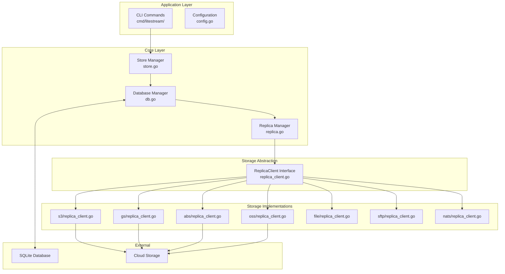
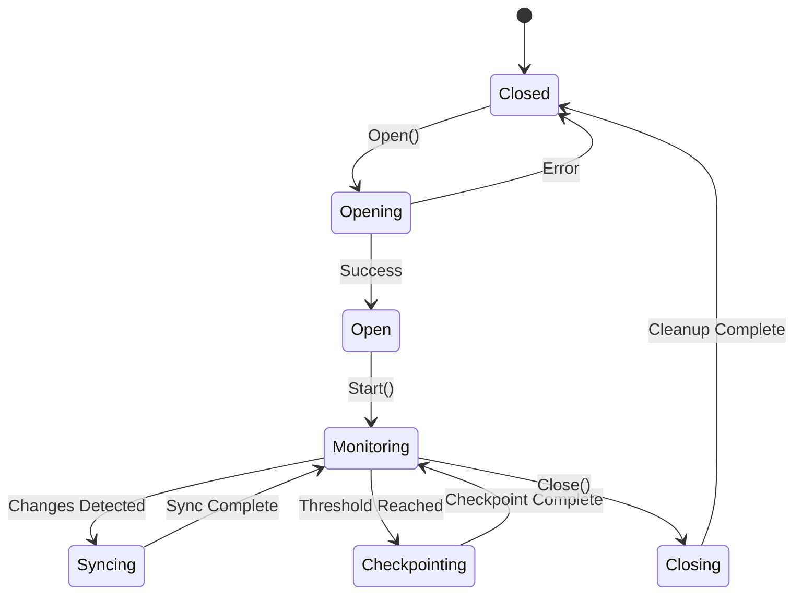
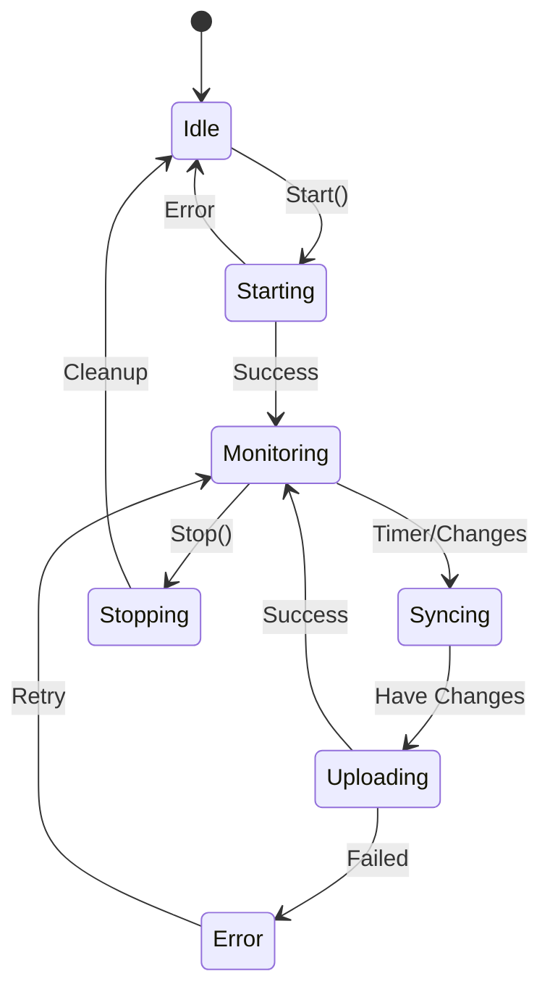
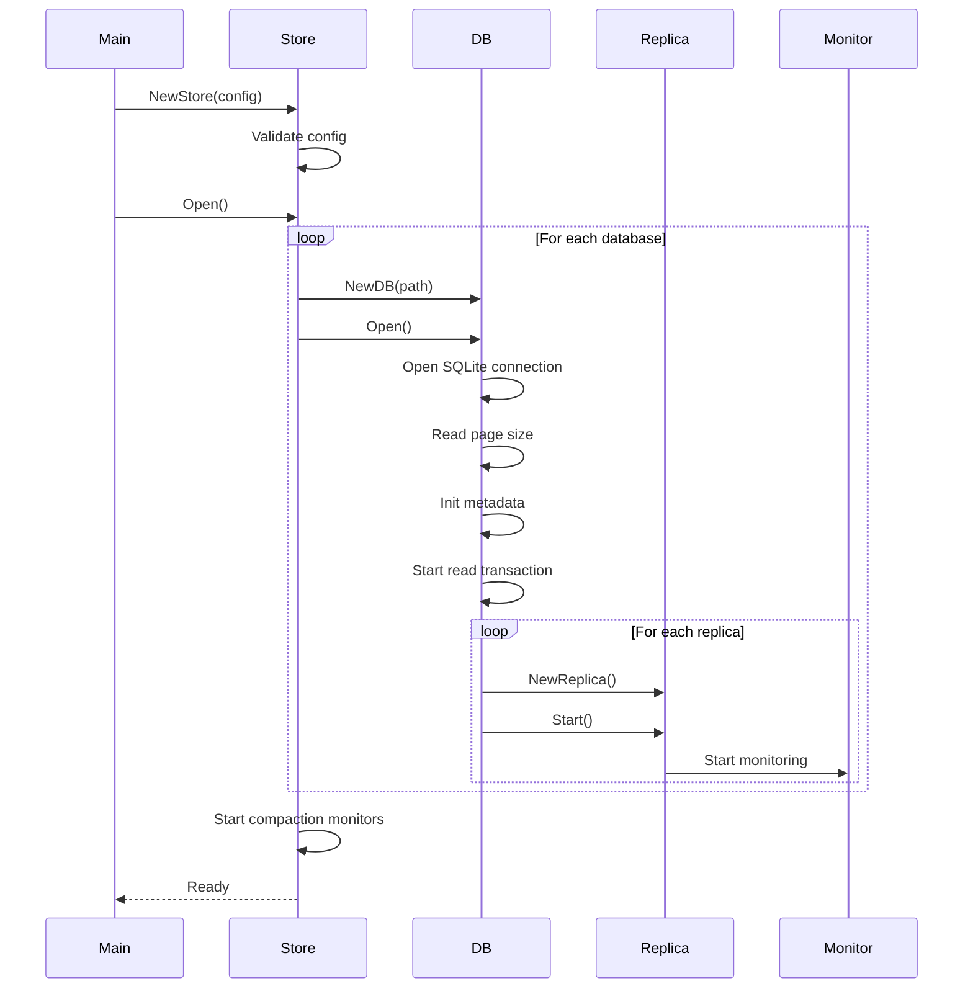

# Litestream Architecture - Technical Deep Dive

## Table of Contents
- [System Layers](#system-layers)
- [Core Components](#core-components)
- [LTX File Format](#ltx-file-format)
- [WAL Monitoring Mechanism](#wal-monitoring-mechanism)
- [Compaction Process](#compaction-process)
- [Transaction Management](#transaction-management)
- [Concurrency Model](#concurrency-model)
- [State Management](#state-management)
- [Initialization Flow](#initialization-flow)
- [Error Handling](#error-handling)

## System Layers

Litestream follows a layered architecture with clear separation of concerns:



### Layer Responsibilities

#### 1. Application Layer
- **CLI Commands**: User interface for operations (replicate, restore, etc.)
- **Configuration**: YAML/environment variable parsing and validation

#### 2. Core Layer
- **Store**: Multi-database coordination, compaction scheduling
- **DB**: Single database management, WAL monitoring, checkpointing
- **Replica**: Replication to single destination, position tracking

#### 3. Storage Abstraction
- **ReplicaClient Interface**: Uniform API for all storage backends

#### 4. Storage Implementations
- Backend-specific logic (authentication, retries, optimizations)

## Core Components

### DB Component (db.go)

The DB component is the heart of Litestream, managing a single SQLite database:

```go
type DB struct {
    // Core fields
    path     string      // Database file path
    metaPath string      // Metadata directory path
    db       *sql.DB     // SQLite connection
    f        *os.File    // Long-running file descriptor
    rtx      *sql.Tx     // Long-running read transaction
    pageSize int         // Database page size

    // Synchronization
    mu       sync.RWMutex   // Protects struct fields
    chkMu    sync.RWMutex   // Checkpoint lock
    notify   chan struct{}  // WAL change notifications

    // Lifecycle
    ctx    context.Context
    cancel func()
    wg     sync.WaitGroup

    // Configuration
    MinCheckpointPageN int              // Min pages for passive checkpoint
    TruncatePageN      int              // Pages before emergency truncate checkpoint
    CheckpointInterval time.Duration    // Time-based passive checkpoint interval
    MonitorInterval    time.Duration    // WAL monitoring frequency
    // Note: MaxCheckpointPageN removed (RESTART mode disabled due to #724)

    // Metrics
    dbSizeGauge        prometheus.Gauge
    walSizeGauge       prometheus.Gauge
    txIDGauge          prometheus.Gauge
}
```

#### Key Methods

```go
// Lifecycle
func (db *DB) Open() error
func (db *DB) Close(ctx context.Context) error

// Monitoring
func (db *DB) monitor()              // Background WAL monitoring
func (db *DB) checkWAL() (bool, error)  // Check for WAL changes

// Checkpointing
func (db *DB) Checkpoint(mode string) error
func (db *DB) autoCheckpoint() error

// Replication
func (db *DB) WALReader(pgno uint32) (io.ReadCloser, error)
func (db *DB) Sync(ctx context.Context) error

// Compaction
func (db *DB) Compact(ctx context.Context, destLevel int) (*ltx.FileInfo, error)
```

### Replica Component (replica.go)

Manages replication to a single destination:

```go
type Replica struct {
    db *DB                    // Parent database
    Client ReplicaClient      // Storage backend client

    mu  sync.RWMutex
    pos ltx.Pos              // Current replication position

    // Configuration
    SyncInterval time.Duration
    MonitorEnabled bool

    // Lifecycle
    cancel func()
    wg     sync.WaitGroup
}
```

#### Replication Position

```go
type Pos struct {
    TXID     TXID      // Transaction ID
    PageNo   uint32    // Page number within transaction
    Checksum uint64    // Running checksum
}
```

### Store Component (store.go)

Coordinates multiple databases and manages system-wide resources:

```go
type Store struct {
    mu     sync.Mutex
    dbs    []*DB
    levels CompactionLevels

    // Configuration
    SnapshotInterval           time.Duration
    SnapshotRetention          time.Duration
    L0Retention                time.Duration
    L0RetentionCheckInterval   time.Duration
    CompactionMonitorEnabled bool

    // Lifecycle
    ctx    context.Context
    cancel func()
    wg     sync.WaitGroup
}
```

## LTX File Format

LTX (Log Transaction) files are immutable files containing database changes:

```
+------------------+
|     Header       |  Fixed size header with metadata
+------------------+
|                  |
|   Page Frames    |  Variable number of page frames
|                  |
+------------------+
|   Page Index     |  Index for efficient page lookup
+------------------+
|     Trailer      |  Metadata and checksums
+------------------+
```

### Header Structure

```go
type Header struct {
    Magic       [4]byte  // "LTX\x00"
    Version     uint32   // Format version
    PageSize    uint32   // Database page size
    MinTXID     TXID     // Starting transaction ID
    MaxTXID     TXID     // Ending transaction ID
    Timestamp   int64    // Creation timestamp
    Checksum    uint64   // Header checksum
}
```

### Page Frame Structure

```go
type PageFrame struct {
    Header PageHeader
    Data   []byte     // Page data (pageSize bytes)
}

type PageHeader struct {
    PageNo   uint32    // Page number in database
    Size     uint32    // Size of page data
    Checksum uint64    // Page checksum
}
```

### Page Index

Binary search tree for efficient page lookup:
```go
type PageIndexElem struct {
    PageNo uint32    // Page number
    Offset int64     // Offset in file
    Size   uint32    // Size of page frame
}
```

### Trailer

```go
type Trailer struct {
    PageIndexOffset int64   // Offset to page index
    PageIndexSize   int64   // Size of page index
    PageCount       uint32  // Total pages in file
    Checksum        uint64  // Full file checksum
}
```

## WAL Monitoring Mechanism

### Monitor Loop (db.go:1499)

```go
func (db *DB) monitor() {
    ticker := time.NewTicker(db.MonitorInterval)
    defer ticker.Stop()

    for {
        select {
        case <-ticker.C:
            // Check WAL for changes
            changed, err := db.checkWAL()
            if err != nil {
                slog.Error("wal check failed", "error", err)
                continue
            }

            if changed {
                // Notify replicas of changes
                db.notifyReplicas()

                // Check if checkpoint needed
                if db.shouldCheckpoint() {
                    db.autoCheckpoint()
                }
            }

        case <-db.ctx.Done():
            return
        }
    }
}
```

### WAL Change Detection

```go
func (db *DB) checkWAL() (bool, error) {
    // Get current WAL state
    walInfo, err := db.walInfo()
    if err != nil {
        return false, err
    }

    // Compare with previous state
    db.mu.Lock()
    changed := walInfo.Size != db.prevWALSize ||
               walInfo.Checksum != db.prevWALChecksum
    db.prevWALSize = walInfo.Size
    db.prevWALChecksum = walInfo.Checksum
    db.mu.Unlock()

    return changed, nil
}
```

## Compaction Process

Compaction merges multiple LTX files to reduce storage overhead:

### Compaction Algorithm (store.go:189)

High-level compaction flow:

1. Determine whether the level is due for compaction (`Store.shouldCompact`).
2. Enumerate level-`L-1` files using `ReplicaClient.LTXFiles`, preferring local
   copies via `os.Open(db.LTXPath(...))` and falling back to
   `ReplicaClient.OpenLTXFile` only when necessary.
3. Stream the source readers through `ltx.NewCompactor`, which performs
   page-level deduplication and enforces lock-page skipping automatically.
4. Pipe the compactor output into `ReplicaClient.WriteLTXFile` to create the
   merged LTX file for level `L`.
5. Adjust the returned `ltx.FileInfo.CreatedAt` to the earliest timestamp from
   the source files so point-in-time recovery remains accurate.
6. Update the cached max file info for the level and delete old L0 files when
   promoting to level 1.

### Compaction Levels

```go
type CompactionLevel struct {
    Level    int           // Level number (0 = raw, 1+ = compacted)
    Interval time.Duration // How often to compact from previous level
}

// Default configuration
var DefaultCompactionLevels = CompactionLevels{
    {Level: 0, Interval: 0},          // Raw LTX files
    {Level: 1, Interval: 1 * Hour},   // Hourly compaction
    {Level: 2, Interval: 24 * Hour},  // Daily compaction
}
```

## Transaction Management

### Long-Running Read Transaction

Litestream maintains a long-running read transaction to ensure consistency:

```go
func (db *DB) initReadTx() error {
    // Start read transaction
    tx, err := db.db.BeginTx(context.Background(), &sql.TxOptions{
        ReadOnly: true,
    })
    if err != nil {
        return err
    }

    // Execute dummy query to start transaction
    var dummy string
    err = tx.QueryRow("SELECT ''").Scan(&dummy)
    if err != nil {
        tx.Rollback()
        return err
    }

    db.rtx = tx
    return nil
}
```

**Purpose:**
- Prevents database from being modified during replication
- Ensures consistent view of database
- Allows reading historical pages from WAL

### Checkpoint Coordination

```go
func (db *DB) Checkpoint(mode string) error {
    // Acquire checkpoint lock
    db.chkMu.Lock()
    defer db.chkMu.Unlock()

    // Close read transaction temporarily
    if db.rtx != nil {
        db.rtx.Rollback()
        db.rtx = nil
    }

    // Perform checkpoint
    _, _, err := db.db.Exec(fmt.Sprintf("PRAGMA wal_checkpoint(%s)", mode))
    if err != nil {
        return err
    }

    // Restart read transaction
    return db.initReadTx()
}
```

## Concurrency Model

### Mutex Usage Patterns

```go
// DB struct mutexes
type DB struct {
    mu     sync.RWMutex  // Protects struct fields
    chkMu  sync.RWMutex  // Checkpoint coordination
}

// Replica struct mutexes
type Replica struct {
    mu  sync.RWMutex    // Protects position
    muf sync.Mutex      // File descriptor lock
}

// Store struct mutex
type Store struct {
    mu sync.Mutex       // Protects database list
}
```

### Lock Ordering (Prevent Deadlocks)

Always acquire locks in this order:
1. Store.mu
2. DB.mu
3. DB.chkMu
4. Replica.mu

### Goroutine Management

```go
// Start background task
func (db *DB) Start() {
    db.wg.Add(1)
    go func() {
        defer db.wg.Done()
        db.monitor()
    }()
}

// Stop with timeout
func (db *DB) Close(ctx context.Context) error {
    // Signal shutdown
    db.cancel()

    // Wait for goroutines with timeout
    done := make(chan struct{})
    go func() {
        db.wg.Wait()
        close(done)
    }()

    select {
    case <-done:
        return nil
    case <-ctx.Done():
        return ctx.Err()
    }
}
```

## State Management

### Database States



### Replica States



### Position Tracking

```go
type Pos struct {
    TXID     TXID      // Current transaction ID
    PageNo   uint32    // Current page number
    Checksum uint64    // Running checksum for validation
}

// Update position atomically
func (r *Replica) SetPos(pos ltx.Pos) {
    r.mu.Lock()  // MUST use Lock, not RLock!
    defer r.mu.Unlock()
    r.pos = pos
}

// Read position safely
func (r *Replica) Pos() ltx.Pos {
    r.mu.RLock()
    defer r.mu.RUnlock()
    return r.pos
}
```

## Initialization Flow

### System Startup Sequence



### Critical Initialization Steps

1. **Database Opening**
   ```go
   // Must happen in order:
   1. Open SQLite connection
   2. Read page size (PRAGMA page_size)
   3. Create metadata directory
   4. Start long-running read transaction
   5. Initialize replicas
   6. Start monitor goroutine
   ```

2. **Replica Initialization**
   ```go
   // Must happen in order:
   1. Create replica with client
   2. Load previous position from metadata
   3. Validate position against database
   4. Start sync goroutine (if monitoring enabled)
   ```

## Error Handling

### Error Categories

1. **Recoverable Errors**
   - Network timeouts
   - Temporary storage unavailability
   - Lock contention

2. **Fatal Errors**
   - Database corruption
   - Invalid configuration
   - Disk full

3. **Operational Errors**
   - Checkpoint failures
   - Compaction conflicts
   - Sync delays

### Error Propagation

```go
// Bottom-up error propagation
ReplicaClient.WriteLTXFile() error
    ↓
Replica.Sync() error
    ↓
DB.Sync() error
    ↓
Store.monitorDB() // Logs error, continues
```

### Retry Logic

```go
func (r *Replica) syncWithRetry(ctx context.Context) error {
    backoff := time.Second
    maxBackoff := time.Minute

    for attempt := 0; ; attempt++ {
        err := r.Sync(ctx)
        if err == nil {
            return nil
        }

        // Check if error is retryable
        if !isRetryable(err) {
            return err
        }

        // Check context
        if ctx.Err() != nil {
            return ctx.Err()
        }

        // Exponential backoff
        time.Sleep(backoff)
        backoff *= 2
        if backoff > maxBackoff {
            backoff = maxBackoff
        }
    }
}
```

## Performance Characteristics

### Time Complexity

| Operation | Complexity | Notes |
|-----------|------------|-------|
| WAL Monitor | O(1) | Fixed interval check |
| Page Write | O(1) | Append to LTX file |
| Compaction | O(n) | n = total pages |
| Restoration | O(n*log(m)) | n = pages, m = files |
| File List | O(k) | k = files in level |

### Space Complexity

| Component | Memory Usage | Disk Usage |
|-----------|-------------|------------|
| DB | O(1) + metrics | Original DB + WAL |
| Replica | O(1) | LTX files + metadata |
| Compaction | O(n) pages | Temporary during merge |
| Page Index | O(p) | p = pages in file |

### Optimization Points

1. **Page Index Caching**
   - Cache frequently accessed indices
   - Use estimated size for initial fetch

2. **Batch Operations**
   - Group small changes into larger LTX files
   - Batch delete operations

3. **Concurrent Operations**
   - Multiple replicas can sync in parallel
   - Compaction runs independently per level

## Security Considerations

### Access Control

- File permissions: 0600 for database files
- Directory permissions: 0700 for metadata
- No built-in authentication (rely on storage backend)

## Monitoring & Metrics

### Prometheus Metrics

```go
// Database metrics
db_size_bytes           // Current database size
wal_size_bytes         // Current WAL size
total_wal_bytes        // Total bytes written to WAL
checkpoint_count       // Number of checkpoints
sync_count            // Number of syncs
sync_error_count      // Number of sync errors

// Replica metrics
replica_lag_seconds    // Replication lag
replica_position      // Current replication position
```

### Health Checks

```go
func (db *DB) HealthCheck() error {
    // Check database connection
    if err := db.db.Ping(); err != nil {
        return fmt.Errorf("database ping failed: %w", err)
    }

    // Check replication lag
    for _, r := range db.replicas {
        lag := time.Since(r.LastSync())
        if lag > MaxAcceptableLag {
            return fmt.Errorf("replica %s lag too high: %v", r.Name(), lag)
        }
    }

    return nil
}
```
