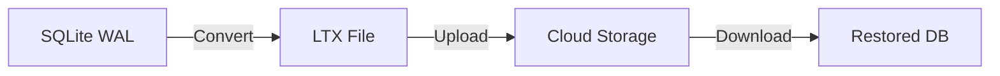
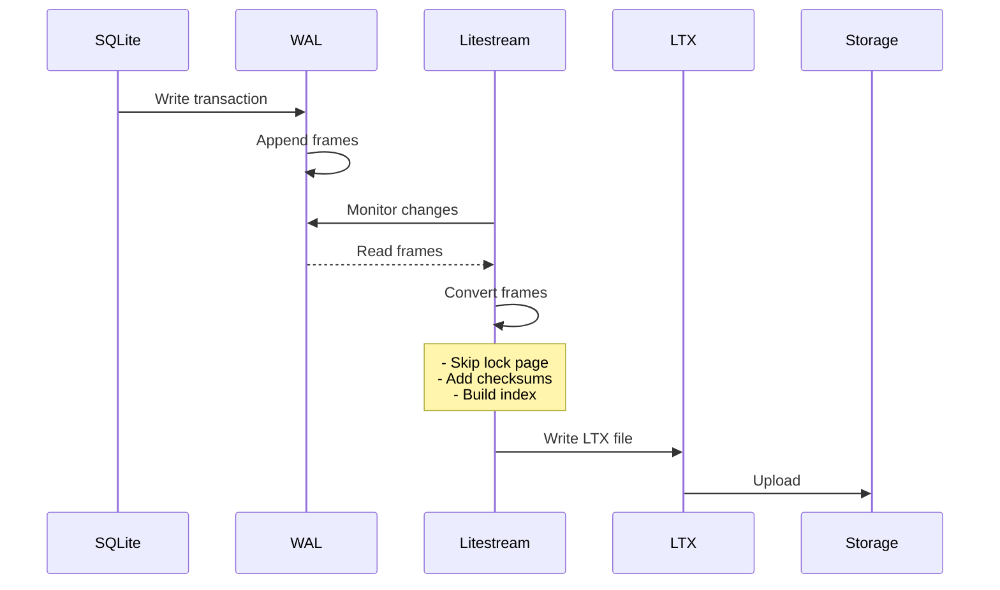

# LTX Format Specification

LTX (Log Transaction) is Litestream's custom format for storing database changes in an immutable, append-only manner.

## Table of Contents
- [Overview](#overview)
- [File Structure](#file-structure)
- [Header Format](#header-format)
- [Page Frames](#page-frames)
- [Page Index](#page-index)
- [Trailer Format](#trailer-format)
- [File Naming Convention](#file-naming-convention)
- [Checksum Calculation](#checksum-calculation)
- [Compaction and Levels](#compaction-and-levels)
- [Reading LTX Files](#reading-ltx-files)
- [Writing LTX Files](#writing-ltx-files)
- [Relationship to SQLite WAL](#relationship-to-sqlite-wal)

## Overview

LTX files are immutable snapshots of database changes:
- **Immutable**: Once written, never modified
- **Append-only**: New changes create new files
- **Self-contained**: Each file is independent
- **Indexed**: Contains page index for efficient seeks
- **Checksummed**: Integrity verification built-in



## File Structure

```
┌─────────────────────┐
│      Header         │ Fixed size (varies by version)
├─────────────────────┤
│                     │
│    Page Frames      │ Variable number of pages
│                     │
├─────────────────────┤
│    Page Index       │ Binary search tree
├─────────────────────┤
│      Trailer        │ Fixed size metadata
└─────────────────────┘
```

### Size Calculation

```go
FileSize = HeaderSize +
           (PageCount * (PageHeaderSize + PageSize)) +
           PageIndexSize +
           TrailerSize
```

## Header Format

The LTX header contains metadata about the file:

```go
// From github.com/superfly/ltx
type Header struct {
    // Magic bytes: "LTX\x00" (0x4C545800)
    Magic    [4]byte

    // Format version (current: 0)
    Version  uint32

    // Flags for special behaviors
    Flags    uint32

    // Database page size (typically 4096)
    PageSize uint32

    // Database page count at snapshot
    PageCount uint32

    // Transaction ID range
    MinTXID  TXID  // uint64
    MaxTXID  TXID  // uint64

    // Checksum of header
    Checksum uint64
}

// Header flags
const (
    HeaderFlagNoChecksum = 1 << 0  // Disable checksums
)
```

### Binary Layout (Header)

```
Offset  Size  Field
0       4     Magic ("LTX\x00")
4       4     Version
8       4     Flags
12      4     PageSize
16      4     PageCount
20      8     MinTXID
28      8     MaxTXID
36      8     Checksum
Total: 44 bytes
```

## Page Frames

Each page frame contains a database page with metadata:

```go
type PageFrame struct {
    Header PageHeader
    Data   []byte  // Size = PageSize from LTX header
}

type PageHeader struct {
    PageNo   uint32  // Page number in database (1-based)
    Checksum uint64  // CRC-64 checksum of page data
}
```

### Binary Layout (Page Frame)

```
Offset  Size     Field
0       4        Page Number
4       8        Checksum
12      PageSize Page Data
```

### Page Frame Constraints

1. **Sequential Writing**: Pages written in order during creation
2. **Random Access**: Can seek to any page using index
3. **Lock Page Skipping**: Page at 1GB boundary never included
4. **Deduplication**: In compacted files, only latest version of each page

## Page Index

The page index enables efficient random access to pages:

```go
type PageIndexElem struct {
    PageNo uint32  // Database page number
    Offset int64   // Byte offset in LTX file
}

// Index is sorted by PageNo for binary search
type PageIndex []PageIndexElem
```

### Binary Layout (Page Index)

```
Each entry (16 bytes):
Offset  Size  Field
0       4     Page Number
4       4     Reserved (padding)
8       8     File Offset

Total index size = EntryCount * 16
```

### Index Usage

```go
// Finding a page using the index
func findPage(index []PageIndexElem, targetPageNo uint32) (offset int64, found bool) {
    // Binary search
    idx := sort.Search(len(index), func(i int) bool {
        return index[i].PageNo >= targetPageNo
    })

    if idx < len(index) && index[idx].PageNo == targetPageNo {
        return index[idx].Offset, true
    }
    return 0, false
}
```

## Trailer Format

The trailer contains metadata and pointers:

```go
type Trailer struct {
    // Offset to start of page index
    PageIndexOffset int64

    // Size of page index in bytes
    PageIndexSize int64

    // Total checksum of all pages
    Checksum uint64
}
```

### Binary Layout (Trailer)

```
Offset  Size  Field
0       8     Page Index Offset
8       8     Page Index Size
16      8     Checksum
Total: 24 bytes
```

### Reading Trailer

The trailer is always at the end of the file:

```go
func readTrailer(f *os.File) (*Trailer, error) {
    // Seek to trailer position
    _, err := f.Seek(-TrailerSize, io.SeekEnd)
    if err != nil {
        return nil, err
    }

    var trailer Trailer
    err = binary.Read(f, binary.BigEndian, &trailer)
    return &trailer, err
}
```

## File Naming Convention

LTX files follow a strict naming pattern:

```
Format: MMMMMMMMMMMMMMMM-NNNNNNNNNNNNNNNN.ltx
Where:
  M = MinTXID (16 hex digits, zero-padded)
  N = MaxTXID (16 hex digits, zero-padded)

Examples:
  0000000000000001-0000000000000064.ltx  (TXID 1-100)
  0000000000000065-00000000000000c8.ltx  (TXID 101-200)
```

### Parsing Filenames

```go
// From github.com/superfly/ltx
func ParseFilename(name string) (minTXID, maxTXID TXID, err error) {
    // Remove extension
    name = strings.TrimSuffix(name, ".ltx")

    // Split on hyphen
    parts := strings.Split(name, "-")
    if len(parts) != 2 {
        return 0, 0, errors.New("invalid format")
    }

    // Parse hex values
    min, err := strconv.ParseUint(parts[0], 16, 64)
    max, err := strconv.ParseUint(parts[1], 16, 64)

    return TXID(min), TXID(max), nil
}

func FormatFilename(minTXID, maxTXID TXID) string {
    return fmt.Sprintf("%016x-%016x.ltx", minTXID, maxTXID)
}
```

## Checksum Calculation

LTX uses CRC-64 ECMA checksums:

```go
import "hash/crc64"

var crcTable = crc64.MakeTable(crc64.ECMA)

func calculateChecksum(data []byte) uint64 {
    return crc64.Checksum(data, crcTable)
}

// Cumulative checksum for multiple pages
func cumulativeChecksum(pages [][]byte) uint64 {
    h := crc64.New(crcTable)
    for _, page := range pages {
        h.Write(page)
    }
    return h.Sum64()
}
```

### Verification During Read

```go
func verifyPage(header PageHeader, data []byte) error {
    if header.Checksum == 0 {
        return nil // Checksums disabled
    }

    calculated := calculateChecksum(data)
    if calculated != header.Checksum {
        return fmt.Errorf("checksum mismatch: expected %x, got %x",
            header.Checksum, calculated)
    }
    return nil
}
```

## Compaction and Levels

LTX files are organized in levels for efficient compaction:

```
Level 0: Raw files (no compaction)
         /ltx/0000/0000000000000001-0000000000000064.ltx
         /ltx/0000/0000000000000065-00000000000000c8.ltx

Level 1: Hourly compaction
         /ltx/0001/0000000000000001-0000000000000fff.ltx

Level 2: Daily compaction
         /ltx/0002/0000000000000001-000000000000ffff.ltx

Snapshots: Full database state
          /snapshots/20240101120000.ltx
```

### Compaction Process

```go
func compactLTXFiles(files []*LTXFile) (*LTXFile, error) {
    // Create page map (newer overwrites older)
    pageMap := make(map[uint32]Page)

    for _, file := range files {
        for _, page := range file.Pages {
            pageMap[page.Number] = page
        }
    }

    // Create new LTX with merged pages
    merged := &LTXFile{
        MinTXID: files[0].MinTXID,
        MaxTXID: files[len(files)-1].MaxTXID,
    }

    // Add pages in order (skip lock page)
    for pgno := uint32(1); pgno <= maxPgno; pgno++ {
        if pgno == LockPageNumber(pageSize) {
            continue // Skip 1GB lock page
        }
        if page, ok := pageMap[pgno]; ok {
            merged.Pages = append(merged.Pages, page)
        }
    }

    return merged, nil
}
```

## Reading LTX Files

### Complete File Read

```go
func ReadLTXFile(path string) (*LTXFile, error) {
    f, err := os.Open(path)
    if err != nil {
        return nil, err
    }
    defer f.Close()

    dec := ltx.NewDecoder(f)

    // Read and verify header
    header, err := dec.Header()
    if err != nil {
        return nil, err
    }

    // Read all pages
    var pages []Page
    for {
        var pageHeader ltx.PageHeader
        pageData := make([]byte, header.PageSize)

        err := dec.DecodePage(&pageHeader, pageData)
        if err == io.EOF {
            break
        }
        if err != nil {
            return nil, err
        }

        pages = append(pages, Page{
            Number: pageHeader.PageNo,
            Data:   pageData,
        })
    }

    return &LTXFile{
        Header: header,
        Pages:  pages,
    }, nil
}
```

### Partial Read Using Index

```go
func ReadPage(path string, pageNo uint32) ([]byte, error) {
    f, err := os.Open(path)
    if err != nil {
        return nil, err
    }
    defer f.Close()

    // Read trailer to find index
    trailer, err := readTrailer(f)
    if err != nil {
        return nil, err
    }

    // Read page index
    f.Seek(trailer.PageIndexOffset, io.SeekStart)
    indexData := make([]byte, trailer.PageIndexSize)
    f.Read(indexData)

    index := parsePageIndex(indexData)

    // Find page in index
    offset, found := findPage(index, pageNo)
    if !found {
        return nil, errors.New("page not found")
    }

    // Read page at offset
    f.Seek(offset, io.SeekStart)

    var pageHeader PageHeader
    binary.Read(f, binary.BigEndian, &pageHeader)

    pageData := make([]byte, pageSize)
    f.Read(pageData)

    return pageData, nil
}
```

## Writing LTX Files

### Creating New LTX File

```go
func WriteLTXFile(path string, pages []Page) error {
    f, err := os.Create(path)
    if err != nil {
        return err
    }
    defer f.Close()

    enc := ltx.NewEncoder(f)

    // Write header
    header := ltx.Header{
        Version:   ltx.Version,
        Flags:     0,
        PageSize:  4096,
        PageCount: uint32(len(pages)),
        MinTXID:   minTXID,
        MaxTXID:   maxTXID,
    }

    if err := enc.EncodeHeader(header); err != nil {
        return err
    }

    // Write pages and build index
    var index []PageIndexElem
    for _, page := range pages {
        offset := enc.Offset()

        // Skip lock page
        if page.Number == LockPageNumber(header.PageSize) {
            continue
        }

        pageHeader := ltx.PageHeader{
            PageNo:   page.Number,
            Checksum: calculateChecksum(page.Data),
        }

        if err := enc.EncodePage(pageHeader, page.Data); err != nil {
            return err
        }

        index = append(index, PageIndexElem{
            PageNo: page.Number,
            Offset: offset,
        })
    }

    // Write page index
    if err := enc.EncodePageIndex(index); err != nil {
        return err
    }

    // Write trailer
    if err := enc.EncodeTrailer(); err != nil {
        return err
    }

    return enc.Close()
}
```

## Relationship to SQLite WAL

### WAL to LTX Conversion



### Key Differences

| Aspect | SQLite WAL | LTX Format |
|--------|------------|------------|
| Purpose | Temporary changes | Permanent archive |
| Mutability | Mutable (checkpoint) | Immutable |
| Structure | Sequential frames | Indexed pages |
| Checksum | Per-frame | Per-page + cumulative |
| Lock Page | Contains lock bytes | Always skipped |
| Naming | Fixed (-wal suffix) | TXID range |
| Lifetime | Until checkpoint | Forever |
| Size | Grows until checkpoint | Fixed at creation |

### Transaction ID (TXID)

```go
type TXID uint64

// TXID represents a logical transaction boundary
// Not directly from SQLite, but derived from:
// 1. WAL checkpoint sequence
// 2. Frame count
// 3. Logical grouping of changes

func (db *DB) nextTXID() TXID {
    // Increment from last known TXID
    return db.lastTXID + 1
}
```

## Best Practices

### 1. Always Skip Lock Page

```go
const PENDING_BYTE = 0x40000000

func shouldSkipPage(pageNo uint32, pageSize int) bool {
    lockPage := uint32(PENDING_BYTE/pageSize) + 1
    return pageNo == lockPage
}
```

### 2. Preserve Timestamps During Compaction

```go
// Keep earliest CreatedAt from source files
func compactWithTimestamp(files []*FileInfo) *FileInfo {
    earliest := files[0].CreatedAt
    for _, f := range files[1:] {
        if f.CreatedAt.Before(earliest) {
            earliest = f.CreatedAt
        }
    }

    return &FileInfo{
        CreatedAt: earliest, // Preserve for point-in-time recovery
    }
}
```

### 3. Verify Checksums on Read

```go
func safeReadLTX(path string) (*LTXFile, error) {
    file, err := ReadLTXFile(path)
    if err != nil {
        return nil, err
    }

    // Verify all checksums
    for _, page := range file.Pages {
        if err := verifyPage(page); err != nil {
            return nil, fmt.Errorf("corrupted page %d: %w",
                page.Number, err)
        }
    }

    return file, nil
}
```

### 4. Handle Partial Files

```go
// For eventually consistent storage
func readWithRetry(client ReplicaClient, info *FileInfo) ([]byte, error) {
    for attempts := 0; attempts < 5; attempts++ {
        data, err := client.OpenLTXFile(...)
        if err == nil {
            // Verify we got complete file
            if int64(len(data)) == info.Size {
                return data, nil
            }
        }

        time.Sleep(time.Second * time.Duration(attempts+1))
    }

    return nil, errors.New("incomplete file after retries")
}
```

## Debugging LTX Files

### Inspect LTX File

```bash
# Using litestream CLI
litestream ltx info file.ltx

# Output:
# Version: 0
# Page Size: 4096
# Page Count: 1234
# Min TXID: 1
# Max TXID: 100
# File Size: 5.2MB
```

### Dump Pages

```bash
# List all pages in file
litestream ltx pages file.ltx

# Dump specific page
litestream ltx page file.ltx 42
```

### Verify Integrity

```bash
# Check all checksums
litestream ltx verify file.ltx

# Output:
# Header checksum: OK
# Page checksums: OK (1234/1234)
# Trailer checksum: OK
# File integrity: VALID
```

## Summary

LTX format provides:
1. **Immutable history** - Every change preserved
2. **Efficient storage** - Indexed, compressed via compaction
3. **Data integrity** - Checksums at multiple levels
4. **Point-in-time recovery** - Via TXID ranges
5. **Cloud-optimized** - Designed for object storage

Understanding LTX is essential for:
- Implementing replica clients
- Debugging replication issues
- Optimizing compaction
- Ensuring data integrity
- Building recovery tools
