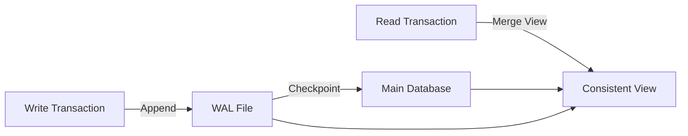
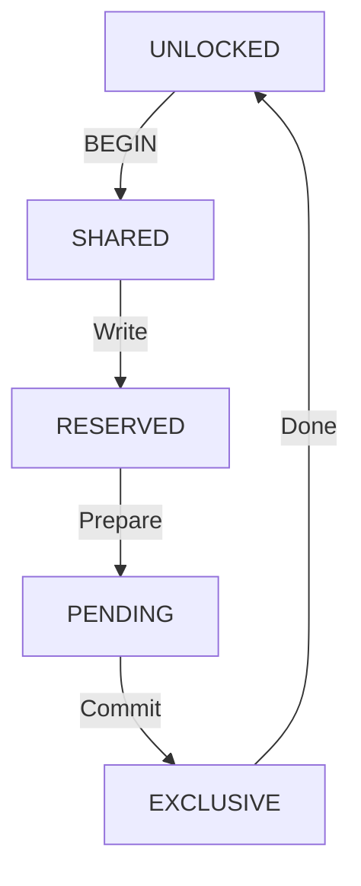

# SQLite Internals for Litestream

This document explains SQLite internals critical for understanding Litestream's operation.

## Table of Contents
- [SQLite File Structure](#sqlite-file-structure)
- [Write-Ahead Log (WAL)](#write-ahead-log-wal)
- [Page Structure](#page-structure)
- [The 1GB Lock Page](#the-1gb-lock-page)
- [Transaction Management](#transaction-management)
- [Checkpoint Modes](#checkpoint-modes)
- [Important SQLite Pragmas](#important-sqlite-pragmas)
- [SQLite API Usage](#sqlite-api-usage)

## SQLite File Structure

SQLite databases consist of:
1. **Main database file** - Contains actual data in pages
2. **WAL file** (-wal suffix) - Contains uncommitted changes
3. **SHM file** (-shm suffix) - Shared memory for coordination

```
database.db         # Main database file (pages)
database.db-wal     # Write-ahead log
database.db-shm     # Shared memory file
```

## Write-Ahead Log (WAL)

### WAL Basics

WAL is SQLite's method for implementing atomic commits and rollback:
- Changes are first written to WAL
- Original database file unchanged until checkpoint
- Readers see consistent view through WAL



### WAL File Structure

```
+------------------+
| WAL Header       | 32 bytes
+------------------+
| Frame 1 Header   | 24 bytes
| Frame 1 Data     | Page size bytes
+------------------+
| Frame 2 Header   | 24 bytes
| Frame 2 Data     | Page size bytes
+------------------+
| ...              |
+------------------+
```

#### WAL Header (32 bytes)
```go
type WALHeader struct {
    Magic         [4]byte  // 0x377f0682 or 0x377f0683
    FileFormat    uint32   // File format version (3007000)
    PageSize      uint32   // Database page size
    Checkpoint    uint32   // Checkpoint sequence number
    Salt1         uint32   // Random salt for checksum
    Salt2         uint32   // Random salt for checksum
    Checksum1     uint32   // Header checksum
    Checksum2     uint32   // Header checksum
}
```

#### WAL Frame Header (24 bytes)
```go
type WALFrameHeader struct {
    PageNumber    uint32   // Page number in database
    DbSize        uint32   // Size of database in pages
    Salt1         uint32   // Must match header salt
    Salt2         uint32   // Must match header salt
    Checksum1     uint32   // Cumulative checksum
    Checksum2     uint32   // Cumulative checksum
}
```

### Reading WAL in Litestream

```go
// db.go - Reading WAL for replication
func (db *DB) readWAL() ([]Page, error) {
    walPath := db.path + "-wal"
    f, err := os.Open(walPath)
    if err != nil {
        return nil, err
    }
    defer f.Close()

    // Read WAL header
    var header WALHeader
    binary.Read(f, binary.BigEndian, &header)

    // Validate magic number
    magic := binary.BigEndian.Uint32(header.Magic[:])
    if magic != 0x377f0682 && magic != 0x377f0683 {
        return nil, errors.New("invalid WAL magic")
    }

    // Read frames
    var pages []Page
    for {
        var frameHeader WALFrameHeader
        err := binary.Read(f, binary.BigEndian, &frameHeader)
        if err == io.EOF {
            break
        }

        // Read page data
        pageData := make([]byte, header.PageSize)
        f.Read(pageData)

        pages = append(pages, Page{
            Number: frameHeader.PageNumber,
            Data:   pageData,
        })
    }

    return pages, nil
}
```

## Page Structure

### Database Pages

SQLite divides the database into fixed-size pages:

```
Page Size: Typically 4096 bytes (4KB)
Page Number: 1-based indexing
Page Types:
  - B-tree interior pages
  - B-tree leaf pages
  - Overflow pages
  - Freelist pages
  - Lock byte page (at 1GB)
```

### Page Layout

```
+------------------+
| Page Header      | Variable (8-12 bytes)
+------------------+
| Cell Pointers    | 2 bytes each
+------------------+
| Unallocated      |
| Space            |
+------------------+
| Cell Content     | Variable size
| Area             | (grows upward)
+------------------+
```

### Page Header Structure

```go
type PageHeader struct {
    PageType      byte     // 0x02, 0x05, 0x0a, 0x0d
    FreeBlockStart uint16  // Start of free block list
    CellCount     uint16   // Number of cells
    CellStart     uint16   // Offset to first cell
    FragmentBytes byte     // Fragmented free bytes
    // Additional fields for interior pages
    RightChild    uint32   // Only for interior pages
}
```

## The 1GB Lock Page

### Critical Concept

SQLite reserves a special page at exactly 1,073,741,824 bytes (0x40000000) for locking:

```go
const PENDING_BYTE = 0x40000000  // 1GB mark

// Page number varies by page size
func LockPageNumber(pageSize int) uint32 {
    return uint32(PENDING_BYTE/pageSize) + 1
}

// Examples:
// 4KB pages:  262145 (0x40001)
// 8KB pages:  131073 (0x20001)
// 16KB pages:  65537 (0x10001)
// 32KB pages:  32769 (0x08001)
// 64KB pages:  16385 (0x04001)
```

### Why This Matters

1. **Cannot contain data** - SQLite will never write user data here
2. **Must be skipped** - During replication/compaction
3. **Affects large databases** - Only databases >1GB
4. **Page number changes** - Different for each page size

### Implementation in Litestream

```go
// From superfly/ltx package
func LockPgno(pageSize int) uint32 {
    return uint32(PENDING_BYTE/pageSize) + 1
}

// db.go - Skipping lock page during iteration
for pgno := uint32(1); pgno <= maxPgno; pgno++ {
    if pgno == ltx.LockPgno(db.pageSize) {
        continue // Skip lock page
    }

    // Process normal page
    processPage(pgno)
}
```

### Testing Lock Page

```sql
-- Create database that spans lock page
CREATE TABLE test (id INTEGER PRIMARY KEY, data BLOB);

-- Insert data until database > 1GB
WITH RECURSIVE generate_series(value) AS (
    SELECT 1
    UNION ALL
    SELECT value+1 FROM generate_series
    LIMIT 300000
)
INSERT INTO test SELECT value, randomblob(4000) FROM generate_series;

-- Check database size
PRAGMA page_count;  -- Should be > 262145 for 4KB pages
PRAGMA page_size;   -- Typically 4096

-- Calculate if lock page is in range
-- For 4KB pages: if page_count > 262145, lock page is included
```

## Transaction Management

### SQLite Transaction Types

1. **Deferred Transaction** (default)
   ```sql
   BEGIN DEFERRED;  -- Lock acquired on first use
   ```

2. **Immediate Transaction**
   ```sql
   BEGIN IMMEDIATE; -- RESERVED lock immediately
   ```

3. **Exclusive Transaction**
   ```sql
   BEGIN EXCLUSIVE; -- EXCLUSIVE lock immediately
   ```

### Lock Types in SQLite



1. **SHARED** - Multiple readers allowed
2. **RESERVED** - Signals intent to write
3. **PENDING** - Blocking new SHARED locks
4. **EXCLUSIVE** - Single writer, no readers

### Litestream's Long-Running Read Transaction

```go
// db.go - Maintaining read transaction for consistency
func (db *DB) initReadTx() error {
    // Start read-only transaction
    tx, err := db.db.BeginTx(context.Background(), &sql.TxOptions{
        ReadOnly: true,
    })
    if err != nil {
        return err
    }

    // Execute query to acquire SHARED lock
    var dummy string
    err = tx.QueryRow("SELECT ''").Scan(&dummy)
    if err != nil {
        tx.Rollback()
        return err
    }

    // Keep transaction open
    db.rtx = tx
    return nil
}
```

**Purpose:**
- Prevents database from being checkpointed past our read point
- Ensures consistent view of database
- Allows reading pages from WAL

## Checkpoint Modes

### PASSIVE Checkpoint (default)
```sql
PRAGMA wal_checkpoint(PASSIVE);
```
- Attempts checkpoint
- Fails if readers present
- Non-blocking

### FULL Checkpoint
```sql
PRAGMA wal_checkpoint(FULL);
```
- Waits for readers to finish
- Blocks new readers
- Ensures checkpoint completes

### RESTART Checkpoint
```sql
PRAGMA wal_checkpoint(RESTART);
```
- Like FULL, but also:
- Ensures next writer starts at beginning of WAL
- Resets WAL file

### TRUNCATE Checkpoint
```sql
PRAGMA wal_checkpoint(TRUNCATE);
```
- Like RESTART, but also:
- Truncates WAL file to zero length
- Releases disk space

### Litestream Checkpoint Strategy

```go
// db.go - Checkpoint decision logic
func (db *DB) autoCheckpoint() error {
    walSize := db.WALSize()
    pageCount := walSize / db.pageSize

    if pageCount > db.TruncatePageN {
        // Force truncation for very large WAL (emergency brake)
        return db.Checkpoint("TRUNCATE")
    } else if pageCount > db.MinCheckpointPageN {
        // Try passive checkpoint (non-blocking)
        return db.Checkpoint("PASSIVE")
    } else if db.CheckpointInterval elapsed {
        // Time-based passive checkpoint
        return db.Checkpoint("PASSIVE")
    }
    // Note: RESTART mode permanently removed due to issue #724 (write-blocking)
    }

    return nil
}
```

## Important SQLite Pragmas

### Essential Pragmas for Litestream

```sql
-- Enable WAL mode (required)
PRAGMA journal_mode = WAL;

-- Get database info
PRAGMA page_size;        -- Page size in bytes
PRAGMA page_count;       -- Total pages in database
PRAGMA freelist_count;   -- Free pages

-- WAL information
PRAGMA wal_checkpoint;           -- Perform checkpoint
PRAGMA wal_autocheckpoint;       -- Auto-checkpoint threshold
PRAGMA wal_checkpoint(PASSIVE);  -- Non-blocking checkpoint

-- Database state
PRAGMA integrity_check;  -- Verify database integrity
PRAGMA quick_check;     -- Fast integrity check

-- Lock information
PRAGMA lock_status;     -- Current locks (debug builds)

-- Performance tuning
PRAGMA synchronous = NORMAL;  -- Sync mode
PRAGMA busy_timeout = 5000;   -- Wait 5s for locks
PRAGMA cache_size = -64000;   -- 64MB cache
```

### Reading Pragmas in Go

```go
func getDatabaseInfo(db *sql.DB) (*DBInfo, error) {
    info := &DBInfo{}

    // Page size
    err := db.QueryRow("PRAGMA page_size").Scan(&info.PageSize)

    // Page count
    err = db.QueryRow("PRAGMA page_count").Scan(&info.PageCount)

    // Journal mode
    err = db.QueryRow("PRAGMA journal_mode").Scan(&info.JournalMode)

    // Calculate size
    info.Size = info.PageSize * info.PageCount

    return info, nil
}
```

## SQLite API Usage

### Direct SQLite Access

Litestream uses both database/sql and direct SQLite APIs:

```go
// Using database/sql for queries
db, err := sql.Open("sqlite3", "database.db")

// Using modernc.org/sqlite for low-level access
conn, err := sqlite.Open("database.db")

// Direct page access (requires special builds)
page := readPage(conn, pageNumber)
```

### Connection Modes

```go
// Read-only connection
db, err := sql.Open("sqlite3", "file:database.db?mode=ro")

// WAL mode connection
db, err := sql.Open("sqlite3", "database.db?_journal=WAL")

// With busy timeout
db, err := sql.Open("sqlite3", "database.db?_busy_timeout=5000")

// Multiple options
db, err := sql.Open("sqlite3", "database.db?_journal=WAL&_busy_timeout=5000&_synchronous=NORMAL")
```

### WAL File Access Pattern

```go
// Litestream's approach to reading WAL
func (db *DB) monitorWAL() {
    walPath := db.path + "-wal"

    for {
        // Check WAL file size
        stat, err := os.Stat(walPath)
        if err != nil {
            continue // WAL might not exist yet
        }

        // Compare with last known size
        if stat.Size() > db.lastWALSize {
            // New data in WAL
            db.processWALChanges()
            db.lastWALSize = stat.Size()
        }

        time.Sleep(db.MonitorInterval)
    }
}
```

## Critical SQLite Behaviors

### 1. Automatic Checkpoint
SQLite automatically checkpoints when WAL reaches 1000 pages (default):
```go
// Can interfere with Litestream's control
// Solution: Set high threshold
db.Exec("PRAGMA wal_autocheckpoint = 10000")
```

### 2. Busy Timeout
Default timeout is 0 (immediate failure):
```go
// Set reasonable timeout
db.Exec("PRAGMA busy_timeout = 5000") // 5 seconds
```

### 3. Synchronous Mode
Controls when SQLite waits for disk writes:
```go
// NORMAL is safe with WAL
db.Exec("PRAGMA synchronous = NORMAL")
```

### 4. Page Cache
SQLite maintains an in-memory page cache:
```go
// Set cache size (negative = KB, positive = pages)
db.Exec("PRAGMA cache_size = -64000") // 64MB
```

## WAL to LTX Conversion

Litestream converts WAL frames to LTX format:

```go
func walToLTX(walFrames []WALFrame) *LTXFile {
    ltx := &LTXFile{
        Header: LTXHeader{
            PageSize: walFrames[0].PageSize,
            MinTXID:  walFrames[0].TransactionID,
        },
    }

    for _, frame := range walFrames {
        // Skip lock page
        if frame.PageNumber == LockPageNumber(ltx.Header.PageSize) {
            continue
        }

        ltx.Pages = append(ltx.Pages, Page{
            Number: frame.PageNumber,
            Data:   frame.Data,
        })

        ltx.Header.MaxTXID = frame.TransactionID
    }

    return ltx
}
```

## Key Takeaways

1. **WAL is temporary** - Gets merged back via checkpoint
2. **Lock page is sacred** - Never write data at 1GB mark
3. **Page size matters** - Affects lock page number and performance
4. **Transactions provide consistency** - Long-running read prevents changes
5. **Checkpoints are critical** - Balance between WAL size and performance
6. **SQLite locks coordinate access** - Understanding prevents deadlocks
7. **Pragmas control behavior** - Must be set correctly for Litestream

This understanding is essential for:
- Debugging replication issues
- Implementing new features
- Optimizing performance
- Handling edge cases correctly
